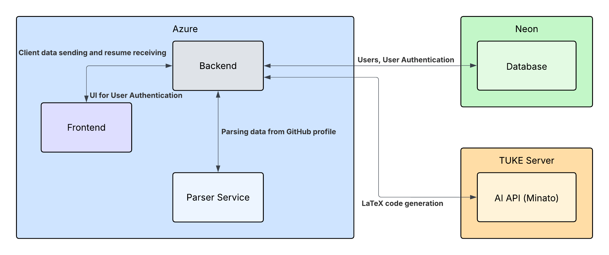

# 📝 AI Resume Creator

This is a **full-stack web application** developed as part of a university project for the course **Fundamentals of Cloud Technologies**. The application parses data from a given **GitHub profile** (with planned support for LinkedIn in the future) and uses an **AI-powered** chat system to generate a personalized **PDF resume** based on the collected information.

## 🎯 Project Objective
As part of the assignment, our team was required to:
- Build a web application with both **frontend** and **backend** components;
- Deploy the application to the **cloud** using different providers for hosting and additional services;
- Integrate at least one **external cloud service** provided by a different vendor than the one hosting the app;
- Include **AI or IoT** functionality within the application;
- Use a **cloud-based database** for data storage;
- Document the architecture and technical choices made during the development;
- Collaborate effectively via **GitHub**, with clear task distribution and version control.

> According to the requirements, the frontend and backend are hosted on different cloud environments. The AI module runs as a separate microservice deployed on a different provider, ensuring the usage of multiple cloud platforms.

## 🚀 Key Features
- 🔗 **GitHub Integration**: Input a GitHub link and extract relevant user data (repos, technologies, languages).
- 🧾 **Parsing Service**: A backend service that parses and transforms GitHub data into structured format for resume generation.
- 💬 **AI Chat Service**: A backend service that receives formatted user data and generates latex code for a resume.
- 🖥️ **Frontend**: Fancy UI to input GitHub URL, interact with AI, and view LaTeX output.
- 🔙 **Backend API**: Handles routing, logic, latext to pdf compilation, and inter-service communication.
- 🗂️ **Database**: Stores account data.

# 💻 Stack 

 

# 👥 Team
| Name                  | Role      | Description                  |
|-----------------------|-----------|------------------------------|
| **Dmytro Varich**         | `Frontend`  | Works on the user interface and user experience design. |
| **Ivan Tkachenko**        | `Backend`, `DB`   | Responsible for server-side logic, inter-service communication and database management. |
| **Nikita Pohorilyi**      | `Parsing Service`   | Specializes in extracting and processing data from various sources. |
| **Arsenii Milenchuk**     | `AI Service`        | Focuses on development of a convenient AI Chat service. |

## 🎨 Frontend
⚫ **`Hosting`** Deployed on Microsoft Azure using Azure Static Web Apps (PaaS). https://ai-creator-resume-cvghh8fjcthhajgb.westeurope-01.azurewebsites.net/

## 🛠️ Backend & Database
⚫ **`C# with ASP.NET Core`** because it provides a robust, high-performance, object-oriented framework for building scalable and secure web APIs.  
⚫ **`Entity Framework Core`** for ORM and database migrations because it seamlessly integrates with C#, simplifies data access, and supports code-first development.  
⚫ **`PostgreSQL`** was selected as the database because of the convenience of hosting it for free on Neon.  
⚫ **`OpenAPI (Swagger)`** to provide automatic API documentation and testing tools.  
⚫ **`Pdflatex`** was used as the LaTeX compiler to enable the generation of PDF files from LaTeX code.  

## 🧠 AI API
⚫ **`FastAPI`** fast, Python:), asynchronous, automatic documentation generation by Swagger.  
⚫ **`Ollama`** interface for interaction with language models, a large library of models and a sufficient number of model usage settings.  
⚫ **`Nginx`** default and popularity for make proxy on server, fast and integrated load balancer.  
All this can be set up using docker-compose. The proxy is not really a necessary part for IP access. It was necessary because the server
where the video card was located was on the university network that using VPN, and for access we needed another server that could process an 
external request and pass it on to our server on the university network, since we added it to VPN network.

## 🕵️‍♂️ Parser
- 🐍 **Python** — because of its simplicity, which allows fast code development, testing, and because of the availability of libraries.    
- 🧴 **Flask** — a web framework for building the REST API.   
- 🍾 **Flask-RESTX** — used for routing and automatic API documentation.
- 🍃 **OpenAPI** — to provide automatic API documentation and testing tools.      
- 📦 **Docker** — for containerizing the application to simplify deployment.    
- ☁️ **GitHub API** — used to fetch user and repository data.   
- 🛠️ **Requests** — for sending HTTP requests to external services.

# 🏗️ Architecture Diagram

# 🐳 How to Use
- Head to the home page ([future link](https://ai-creator-resume-cvghh8fjcthhajgb.westeurope-01.azurewebsites.net/)).
- Create a new account or continue without registration.
- Give your GitHub profile URL.
- (Optional) Write additional brief information about yourself. Recommended format - (Name: John, Surname: Smith, Job: Backend Developer, University: TUKE).
- Send data for processing and wait for your resume to be created.
